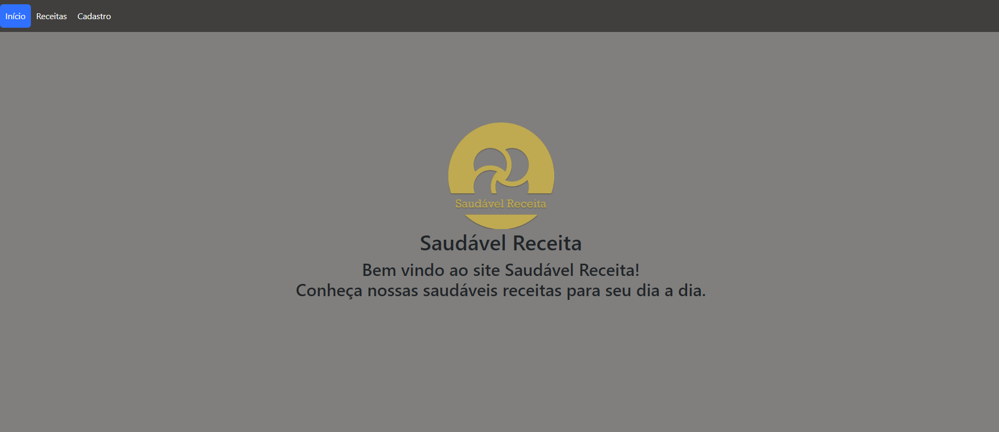

<h1 align="center">
Projeto do primeiro site em HTML e CSS do Curso de Desenvolvimento Full Stack. 
</h1>

 

  

## 🚀 Tecnologias

Esse projeto foi desenvolvido com as seguintes tecnologias:

- HTML e CSS
- Bootstrap
- Git e Github

## 💻 Projeto

Site básico em HTML e CSS para receitas.

## WAPOLASTRELI Desenvolvimento.
